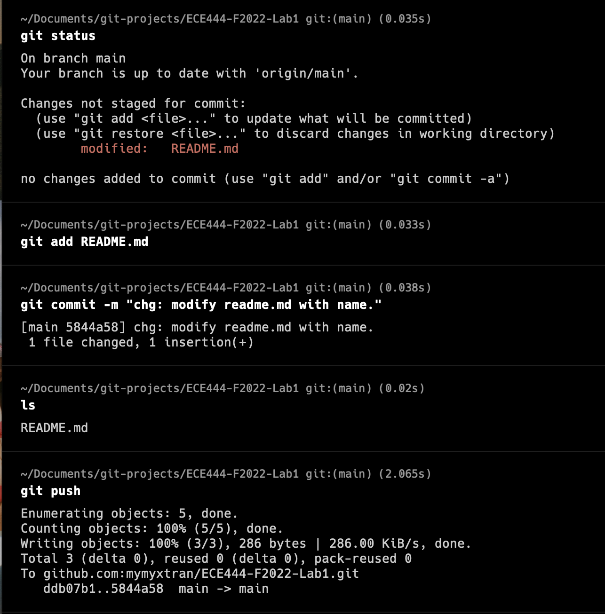

# ECE444-F2022-Lab1
My My Tran 
## Activity 1

## Activity 2

## Activity 3

## Activity 4
[Link to @abhinav0022's repo](https://github.com/abhinav0022/ECE444-F2022-Lab1/tree/develop)

## Activity 5
Conflict rebasing `develop` -> `rebase` branch.

`git status` shows the picked commits from the `rebase` branch.

We can see that the commits from the `rebase` branch are merged into `develop` after commit `c4`.

## Activity 6
[Link to My My's EP Repo](https://github.com/mymyxtran/ECE444-F2022-EP)

## Activity 7
Successfully see the commits from the `feature-change-title` branch are added after rebase.

## Activity 8

